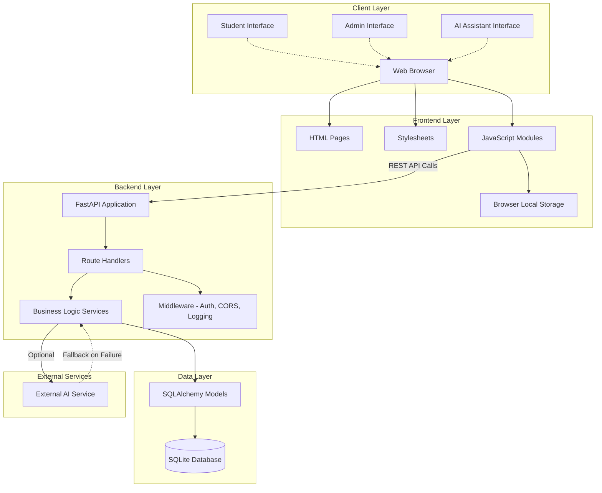
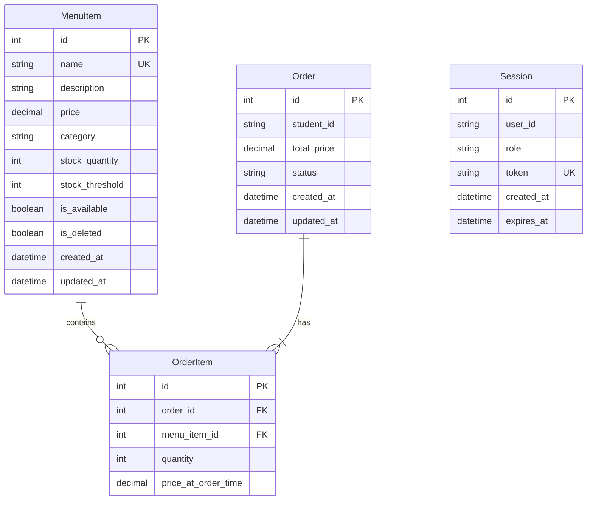
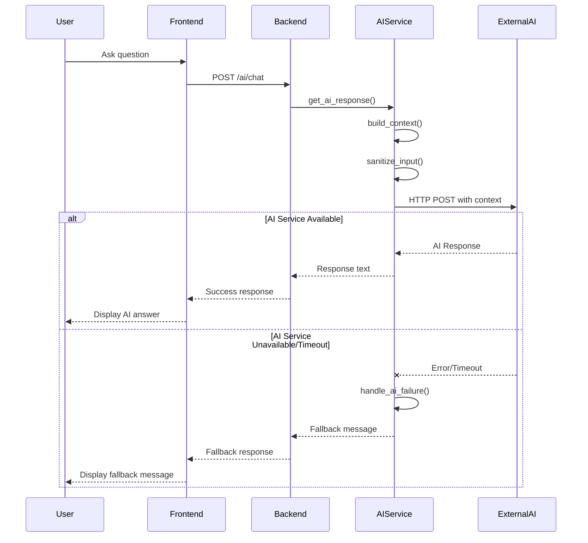
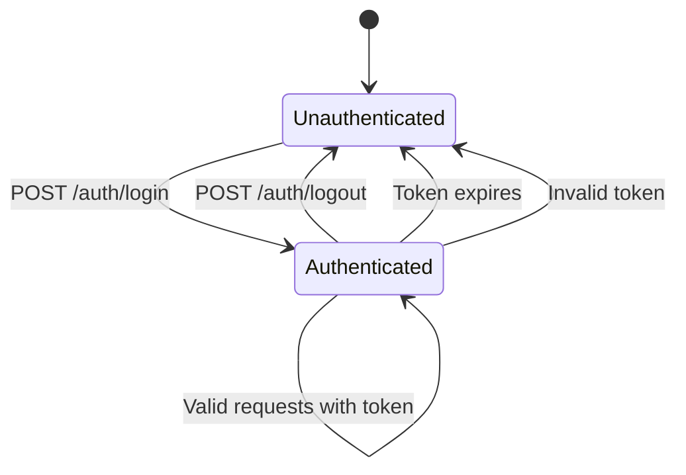
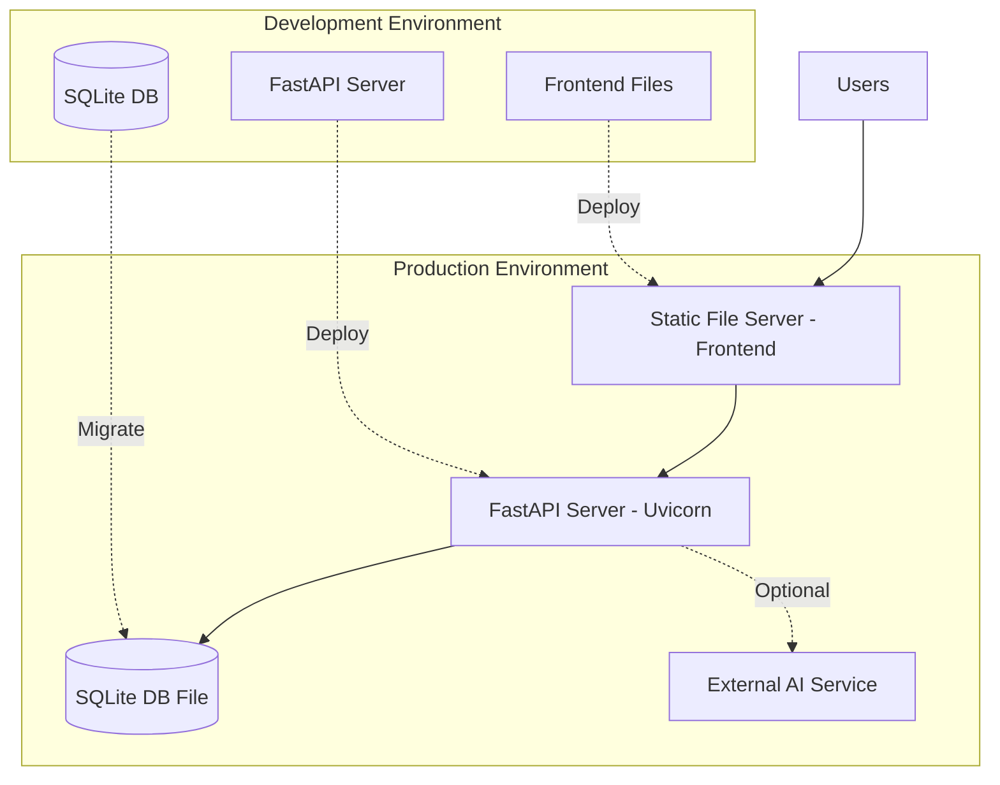

# Technical Design Document

## Overview

The Smart Canteen Manager is a full-stack web application built with a modern three-tier architecture: a vanilla JavaScript frontend, a Python FastAPI backend, and a SQLite database. The system enables students to browse menus and place orders while providing administrators with comprehensive tools for menu management, inventory control, order processing, and sales analytics. An optional AI-powered assistant provides intelligent responses based on real-time canteen data while maintaining full system functionality when AI services are unavailable.

### Key Design Principles

1. **Simplicity**: Vanilla JavaScript frontend with no framework dependencies ensures straightforward maintenance and demonstration
2. **Modularity**: Clear separation between frontend, backend, business logic, and data layers
3. **Graceful Degradation**: All core features work independently of external AI service availability
4. **RESTful Design**: Stateless API with clear resource-oriented endpoints
5. **Security First**: Input validation, SQL injection prevention, session management, and CORS protection
6. **Demonstrability**: Architecture naturally supports spec-driven development, property-based testing, hooks, and custom agents

## Architecture

### System Architecture Diagram



### Architecture Layers

#### 1. Frontend Layer (Client-Side)

**Technology**: HTML5, CSS3, Vanilla JavaScript (ES6+)

**Structure**:
- `index.html` - Landing/login page
- `student.html` - Student interface (menu browsing, cart, orders)
- `admin.html` - Admin interface (menu management, order queue, analytics)
- `styles/` - CSS files organized by component
- `js/` - JavaScript modules organized by functionality

**Responsibilities**:
- User interface rendering and interaction
- Client-side form validation
- REST API communication
- Session token management
- Cart state management (localStorage)
- Real-time UI updates
- Responsive design adaptation

**Key JavaScript Modules**:
- `auth.js` - Authentication and session management
- `api.js` - REST API client wrapper
- `menu.js` - Menu display and filtering
- `cart.js` - Shopping cart logic
- `orders.js` - Order placement and tracking
- `admin.js` - Admin functionality
- `chat.js` - AI assistant interface
- `utils.js` - Shared utilities

#### 2. Backend Layer (Server-Side)

**Technology**: Python 3.8+, FastAPI, Uvicorn

**Structure**:
```
backend/
├── main.py              # Application entry point
├── config.py            # Configuration management
├── database.py          # Database connection and setup
├── models/              # SQLAlchemy ORM models
│   ├── menu_item.py
│   ├── order.py
│   ├── order_item.py
│   └── session.py
├── schemas/             # Pydantic validation schemas
│   ├── menu_item.py
│   ├── order.py
│   └── auth.py
├── routes/              # API route handlers
│   ├── auth.py
│   ├── menu.py
│   ├── orders.py
│   ├── admin.py
│   └── ai_assistant.py
├── services/            # Business logic layer
│   ├── menu_service.py
│   ├── order_service.py
│   ├── inventory_service.py
│   ├── analytics_service.py
│   └── ai_service.py
├── middleware/          # Middleware components
│   ├── auth_middleware.py
│   ├── logging_middleware.py
│   └── rate_limit_middleware.py
└── utils/              # Shared utilities
    ├── validation.py
    └── security.py
```

**Responsibilities**:
- REST API endpoint implementation
- Request validation and sanitization
- Business logic execution
- Database operations
- Session management and authentication
- External AI service integration
- Error handling and logging
- Rate limiting and security

#### 3. Data Layer

**Technology**: SQLite 3, SQLAlchemy ORM

**Responsibilities**:
- Persistent data storage
- Transaction management
- Data integrity enforcement
- Query optimization

#### 4. External Services Layer

**AI Service Integration**:
- External AI API (configurable endpoint)
- Timeout handling (5-second default)
- Graceful degradation on failure
- Context injection (menu, inventory, orders, sales data)

## Components and Interfaces

### Frontend Components

#### 1. Authentication Component

**Purpose**: Handle user login and session management

**Key Functions**:
- `login(userId, role)` - Authenticate user and store session token
- `logout()` - Clear session and redirect to login
- `getCurrentSession()` - Retrieve active session details
- `isAuthenticated()` - Check if user has valid session
- `hasRole(role)` - Check if user has specific role

**Storage**: Session token and user info in `sessionStorage`

#### 2. API Client Component

**Purpose**: Centralized REST API communication

**Key Functions**:
- `get(endpoint, params)` - HTTP GET request
- `post(endpoint, body)` - HTTP POST request
- `put(endpoint, body)` - HTTP PUT request
- `delete(endpoint)` - HTTP DELETE request
- `handleResponse(response)` - Process API responses
- `handleError(error)` - Handle API errors

**Features**:
- Automatic session token injection in headers
- Error handling with user-friendly messages
- Loading state management
- Retry logic for transient failures

#### 3. Menu Display Component

**Purpose**: Display and filter menu items

**Key Functions**:
- `fetchMenu()` - Load menu items from API
- `renderMenu(items)` - Display menu items
- `filterByCategory(category)` - Apply category filter
- `searchMenu(query)` - Filter by search term
- `clearFilters()` - Reset to full menu view

**UI Elements**:
- Search input field
- Category filter buttons
- Menu item cards (name, description, price, availability)
- Add to cart buttons

#### 4. Shopping Cart Component

**Purpose**: Manage cart state and operations

**Key Functions**:
- `addToCart(menuItem)` - Add item to cart
- `updateQuantity(itemId, quantity)` - Change item quantity
- `removeItem(itemId)` - Remove item from cart
- `getCartContents()` - Retrieve current cart
- `calculateTotal()` - Compute total price
- `clearCart()` - Empty cart
- `saveCart()` - Persist to localStorage
- `loadCart()` - Restore from localStorage

**Storage**: Cart state in `localStorage` with key `canteen_cart`

#### 5. Order Management Component

**Purpose**: Order placement and tracking

**Key Functions**:
- `placeOrder(cartItems)` - Submit order to backend
- `getOrderStatus(orderId)` - Fetch current order status
- `getOrderHistory()` - Retrieve user's past orders
- `cancelOrder(orderId)` - Cancel pending order

**UI Elements**:
- Order confirmation modal
- Order status display
- Order history table

#### 6. Admin Dashboard Component

**Purpose**: Admin interface for management tasks

**Key Functions**:
- `fetchOrders()` - Load order queue
- `updateOrderStatus(orderId, newStatus)` - Change order status
- `fetchInventory()` - Load inventory levels
- `updateStock(itemId, quantity)` - Modify stock levels
- `fetchSalesData(dateRange)` - Load analytics
- `fetchLowStockItems()` - Get low-stock alerts

**UI Sections**:
- Order queue with status filters
- Inventory management table
- Sales analytics dashboard
- Low-stock alerts panel

#### 7. AI Assistant Component

**Purpose**: Chat interface for AI-powered assistance

**Key Functions**:
- `sendMessage(question)` - Send user query to backend
- `displayMessage(message, sender)` - Add message to chat
- `handleAIResponse(response)` - Process and display AI reply
- `handleAIError()` - Display fallback message on failure

**UI Elements**:
- Chat message container
- Input field and send button
- Loading indicator
- Error/fallback messages

### Backend Components

#### 1. Route Handlers

**Purpose**: Define API endpoints and request/response handling

**Organization**:
- `auth.py` - Authentication endpoints
- `menu.py` - Menu and menu item endpoints
- `orders.py` - Student order endpoints
- `admin.py` - Admin management endpoints
- `ai_assistant.py` - AI chat endpoint

**Responsibilities**:
- Request parsing
- Input validation (Pydantic schemas)
- Service layer invocation
- Response formatting
- HTTP status code selection

#### 2. Service Layer

**Purpose**: Encapsulate business logic and orchestrate operations

**Services**:

**MenuService**:
- `get_available_menu_items()` - Retrieve available items
- `get_menu_item_by_id(item_id)` - Fetch specific item
- `search_menu_items(query, category)` - Search and filter
- `create_menu_item(data)` - Add new menu item (admin)
- `update_menu_item(item_id, data)` - Modify existing item
- `toggle_availability(item_id)` - Enable/disable item
- `delete_menu_item(item_id)` - Soft delete item

**OrderService**:
- `create_order(student_id, items)` - Place new order
- `get_order_by_id(order_id)` - Retrieve order details
- `get_orders_by_student(student_id)` - Get student's orders
- `get_all_orders(status_filter)` - Get all orders (admin)
- `update_order_status(order_id, new_status)` - Change status
- `validate_order_items(items)` - Check availability and stock
- `calculate_order_total(items)` - Compute total price

**InventoryService**:
- `get_inventory()` - Retrieve all stock levels
- `update_stock(item_id, quantity)` - Set stock level
- `increment_stock(item_id, amount)` - Add stock
- `decrement_stock(item_id, amount)` - Remove stock
- `check_stock_availability(item_id, quantity)` - Validate stock
- `get_low_stock_items()` - Find items below threshold
- `update_stock_threshold(item_id, threshold)` - Set alert level

**AnalyticsService**:
- `get_daily_sales(date)` - Calculate daily revenue and orders
- `get_sales_by_date_range(start, end)` - Multi-day analytics
- `get_popular_items(period, top_n)` - Identify popular items
- `calculate_average_order_value(date_range)` - Compute AOV

**AIService**:
- `get_ai_response(question, context)` - Query external AI service
- `build_context()` - Gather canteen data for AI context
- `sanitize_input(text)` - Clean user input
- `handle_ai_failure()` - Return fallback message

#### 3. Data Models (SQLAlchemy)

**Purpose**: Define database schema and ORM mappings

**Models**:

**MenuItem**:
```python
- id: Integer (Primary Key)
- name: String(100) (Unique, Not Null)
- description: String(500)
- price: Decimal(10, 2) (Not Null)
- category: String(50)
- stock_quantity: Integer (Default 0)
- stock_threshold: Integer (Default 5)
- is_available: Boolean (Default True)
- is_deleted: Boolean (Default False)
- created_at: DateTime
- updated_at: DateTime
```

**Order**:
```python
- id: Integer (Primary Key)
- student_id: String(50) (Not Null)
- total_price: Decimal(10, 2) (Not Null)
- status: String(20) (Default 'pending')
- created_at: DateTime
- updated_at: DateTime
- items: Relationship to OrderItem
```

**OrderItem**:
```python
- id: Integer (Primary Key)
- order_id: Integer (Foreign Key to Order)
- menu_item_id: Integer (Foreign Key to MenuItem)
- quantity: Integer (Not Null)
- price_at_order_time: Decimal(10, 2) (Not Null)
- menu_item: Relationship to MenuItem
```

**Session**:
```python
- id: Integer (Primary Key)
- user_id: String(50) (Not Null)
- role: String(20) (Not Null) # 'student' or 'admin'
- token: String(255) (Unique, Not Null)
- created_at: DateTime
- expires_at: DateTime
```

#### 4. Validation Schemas (Pydantic)

**Purpose**: Define request/response validation and serialization

**Schemas**:

**MenuItemCreate**:
```python
- name: str (max 100 chars)
- description: str (max 500 chars)
- price: Decimal (>= 0.01, max 2 decimal places)
- category: str (max 50 chars)
- stock_quantity: int (>= 0)
- stock_threshold: int (>= 0, default 5)
```

**MenuItemResponse**:
```python
- id: int
- name: str
- description: str
- price: Decimal
- category: str
- stock_quantity: int
- is_available: bool
- created_at: datetime
- updated_at: datetime
```

**OrderCreate**:
```python
- items: List[OrderItemCreate]
```

**OrderItemCreate**:
```python
- menu_item_id: int
- quantity: int (>= 1)
```

**OrderResponse**:
```python
- id: int
- student_id: str
- total_price: Decimal
- status: str
- items: List[OrderItemResponse]
- created_at: datetime
- updated_at: datetime
```

**LoginRequest**:
```python
- user_id: str (max 50 chars)
- role: str ('student' or 'admin')
```

**SessionResponse**:
```python
- token: str
- user_id: str
- role: str
- expires_at: datetime
```

#### 5. Middleware Components

**AuthMiddleware**:
- Extract session token from Authorization header
- Validate token against database
- Check token expiration
- Inject user context into request
- Return 401 for invalid/missing tokens

**LoggingMiddleware**:
- Log request method, path, timestamp
- Generate unique request ID
- Log response status and duration
- Log errors with stack traces
- Exclude sensitive data from logs

**RateLimitMiddleware**:
- Track requests per IP address
- Enforce rate limits (100 requests per minute default)
- Return 429 Too Many Requests on limit exceeded
- Configurable limits per endpoint

**CORSMiddleware**:
- Configure allowed origins
- Set appropriate CORS headers
- Handle preflight OPTIONS requests

## Data Models

### Database Schema



### Entity Relationships

1. **MenuItem ↔ OrderItem**: One-to-Many
   - One MenuItem can appear in multiple OrderItems
   - Soft delete on MenuItem preserves historical order data

2. **Order ↔ OrderItem**: One-to-Many
   - One Order contains multiple OrderItems
   - Cascade delete: Deleting an Order deletes its OrderItems

3. **Session**: Independent table
   - No foreign key relationships
   - Self-managed lifecycle with expiration

### Data Integrity Constraints

1. **MenuItem**:
   - `name` must be unique among non-deleted items
   - `price` must be >= 0.01
   - `stock_quantity` must be >= 0
   - `stock_threshold` must be >= 0

2. **Order**:
   - `total_price` must be > 0
   - `status` must be in ['pending', 'preparing', 'ready', 'completed', 'cancelled']

3. **OrderItem**:
   - `quantity` must be >= 1
   - `price_at_order_time` captures price at order time (immutable)
   - Must reference valid MenuItem and Order

4. **Session**:
   - `token` must be unique
   - `role` must be in ['student', 'admin']
   - `expires_at` must be > `created_at`

## API Specifications

### Base URL
```
http://localhost:8000/api/v1
```

### Authentication

All protected endpoints require session token in header:
```
Authorization: Bearer {session_token}
```

### Endpoints

#### Authentication Endpoints

**POST /auth/login**
- Description: Create user session
- Request Body:
  ```json
  {
    "user_id": "string",
    "role": "student" | "admin"
  }
  ```
- Response (200):
  ```json
  {
    "token": "string",
    "user_id": "string",
    "role": "string",
    "expires_at": "datetime"
  }
  ```
- Errors: 400 (invalid input)

**POST /auth/logout**
- Description: Invalidate session
- Auth: Required
- Response (200):
  ```json
  {
    "message": "Logged out successfully"
  }
  ```
- Errors: 401 (not authenticated)

#### Menu Endpoints

**GET /menu/items**
- Description: Get available menu items
- Auth: Required (student or admin)
- Query Parameters:
  - `category` (optional): Filter by category
  - `search` (optional): Search in name/description
- Response (200):
  ```json
  [
    {
      "id": 1,
      "name": "string",
      "description": "string",
      "price": 9.99,
      "category": "string",
      "stock_quantity": 50,
      "is_available": true,
      "created_at": "datetime",
      "updated_at": "datetime"
    }
  ]
  ```
- Errors: 401 (not authenticated)

**GET /menu/items/{item_id}**
- Description: Get specific menu item
- Auth: Required
- Response (200): Single menu item object
- Errors: 401, 404 (item not found)

#### Order Endpoints (Student)

**POST /orders**
- Description: Place new order
- Auth: Required (student or admin)
- Request Body:
  ```json
  {
    "items": [
      {
        "menu_item_id": 1,
        "quantity": 2
      }
    ]
  }
  ```
- Response (201):
  ```json
  {
    "id": 123,
    "student_id": "string",
    "total_price": 19.98,
    "status": "pending",
    "items": [
      {
        "menu_item_id": 1,
        "menu_item_name": "string",
        "quantity": 2,
        "price_at_order_time": 9.99
      }
    ],
    "created_at": "datetime",
    "updated_at": "datetime"
  }
  ```
- Errors: 400 (validation failed, insufficient stock), 401

**GET /orders/{order_id}**
- Description: Get order details
- Auth: Required
- Response (200): Order object with items
- Errors: 401, 404 (order not found)

**GET /orders/history**
- Description: Get user's order history
- Auth: Required (student or admin)
- Query Parameters:
  - `start_date` (optional): Filter from date
  - `end_date` (optional): Filter to date
- Response (200): Array of order objects
- Errors: 401

#### Admin Endpoints - Menu Management

**POST /admin/menu/items**
- Description: Create menu item
- Auth: Required (admin only)
- Request Body:
  ```json
  {
    "name": "string",
    "description": "string",
    "price": 9.99,
    "category": "string",
    "stock_quantity": 50,
    "stock_threshold": 5
  }
  ```
- Response (201): Created menu item object
- Errors: 400 (validation failed, duplicate name), 401, 403

**PUT /admin/menu/items/{item_id}**
- Description: Update menu item
- Auth: Required (admin only)
- Request Body: Partial menu item fields
- Response (200): Updated menu item object
- Errors: 400, 401, 403, 404

**PATCH /admin/menu/items/{item_id}/availability**
- Description: Toggle item availability
- Auth: Required (admin only)
- Request Body:
  ```json
  {
    "is_available": true
  }
  ```
- Response (200): Updated menu item object
- Errors: 401, 403, 404

**DELETE /admin/menu/items/{item_id}**
- Description: Soft delete menu item
- Auth: Required (admin only)
- Response (204): No content
- Errors: 401, 403, 404

#### Admin Endpoints - Inventory Management

**GET /admin/inventory**
- Description: Get all inventory levels
- Auth: Required (admin only)
- Response (200): Array of menu items with stock info
- Errors: 401, 403

**PUT /admin/inventory/{item_id}**
- Description: Update stock quantity
- Auth: Required (admin only)
- Request Body:
  ```json
  {
    "stock_quantity": 100
  }
  ```
- Response (200): Updated menu item object
- Errors: 400, 401, 403, 404

**GET /admin/inventory/low-stock**
- Description: Get items below threshold
- Auth: Required (admin only)
- Response (200):
  ```json
  [
    {
      "id": 1,
      "name": "string",
      "stock_quantity": 3,
      "stock_threshold": 5,
      "difference": -2
    }
  ]
  ```
- Errors: 401, 403

**PUT /admin/inventory/{item_id}/threshold**
- Description: Update stock threshold
- Auth: Required (admin only)
- Request Body:
  ```json
  {
    "stock_threshold": 10
  }
  ```
- Response (200): Updated menu item object
- Errors: 400, 401, 403, 404

#### Admin Endpoints - Order Management

**GET /admin/orders**
- Description: Get all orders
- Auth: Required (admin only)
- Query Parameters:
  - `status` (optional): Filter by status
  - `date` (optional): Filter by date
- Response (200): Array of order objects
- Errors: 401, 403

**PATCH /admin/orders/{order_id}/status**
- Description: Update order status
- Auth: Required (admin only)
- Request Body:
  ```json
  {
    "status": "preparing" | "ready" | "completed" | "cancelled"
  }
  ```
- Response (200): Updated order object
- Errors: 400 (invalid status transition), 401, 403, 404

#### Admin Endpoints - Analytics

**GET /admin/analytics/sales/daily**
- Description: Get daily sales statistics
- Auth: Required (admin only)
- Query Parameters:
  - `date` (optional): Specific date (default today)
- Response (200):
  ```json
  {
    "date": "2024-01-15",
    "total_revenue": 1234.56,
    "order_count": 45,
    "average_order_value": 27.43
  }
  ```
- Errors: 401, 403

**GET /admin/analytics/sales/range**
- Description: Get sales data for date range
- Auth: Required (admin only)
- Query Parameters:
  - `start_date`: Start date (required)
  - `end_date`: End date (required)
- Response (200): Array of daily sales objects
- Errors: 400 (invalid dates), 401, 403

**GET /admin/analytics/popular-items**
- Description: Get popular menu items
- Auth: Required (admin only)
- Query Parameters:
  - `period`: 'daily' | 'weekly' | 'monthly'
  - `top_n`: Number of items (default 10)
- Response (200):
  ```json
  [
    {
      "menu_item_id": 1,
      "name": "string",
      "total_quantity_ordered": 150,
      "order_count": 45,
      "popularity_score": 195.0
    }
  ]
  ```
- Errors: 400, 401, 403

#### AI Assistant Endpoint

**POST /ai/chat**
- Description: Send question to AI assistant
- Auth: Required
- Request Body:
  ```json
  {
    "question": "string"
  }
  ```
- Response (200):
  ```json
  {
    "response": "string",
    "context_used": true,
    "timestamp": "datetime"
  }
  ```
- Fallback Response (200 when AI fails):
  ```json
  {
    "response": "I'm currently unavailable. Please try again later or contact staff for assistance.",
    "context_used": false,
    "timestamp": "datetime"
  }
  ```
- Errors: 400 (empty question), 401

### Error Response Format

All error responses follow this structure:
```json
{
  "error": {
    "code": "string",
    "message": "string",
    "details": {} // optional
  }
}
```

### HTTP Status Codes

- **200 OK**: Successful request
- **201 Created**: Resource created successfully
- **204 No Content**: Successful deletion
- **400 Bad Request**: Validation failed or invalid input
- **401 Unauthorized**: Missing or invalid session token
- **403 Forbidden**: Insufficient permissions
- **404 Not Found**: Resource not found
- **429 Too Many Requests**: Rate limit exceeded
- **500 Internal Server Error**: Unexpected server error

## AI Assistant Integration

### Architecture



### Context Building

The AI service builds context by querying current canteen data:

1. **Menu Context**:
   - Available menu items with prices
   - Categories and descriptions
   - Stock levels

2. **Order Context** (role-based):
   - For students: User's recent orders
   - For admins: Current order queue status

3. **Inventory Context** (admin only):
   - Low-stock items
   - Total items managed

4. **Analytics Context** (admin only):
   - Today's sales figures
   - Popular items

### Context Format

```json
{
  "role": "student" | "admin",
  "canteen_data": {
    "menu": [
      {
        "name": "string",
        "description": "string",
        "price": 9.99,
        "category": "string",
        "available": true
      }
    ],
    "recent_orders": [...],  // For students
    "order_queue": {...},    // For admins
    "inventory_summary": {}, // For admins
    "sales_today": {}        // For admins
  },
  "user_question": "string"
}
```

### AI Service Configuration

**Environment Variables**:
- `AI_SERVICE_URL`: External AI API endpoint
- `AI_SERVICE_API_KEY`: Authentication key (optional)
- `AI_SERVICE_TIMEOUT`: Request timeout in seconds (default: 5)
- `AI_SERVICE_ENABLED`: Feature flag (default: true)

### Error Handling Strategy

1. **Timeout**: Return fallback after 5 seconds
2. **HTTP Errors**: Log error, return fallback
3. **Invalid Response**: Log error, return fallback
4. **Service Disabled**: Return fallback immediately
5. **Network Errors**: Return fallback

### Fallback Messages

- Generic: "I'm currently unavailable. Please try again later or contact staff for assistance."
- Admin-specific: "The AI assistant is temporarily unavailable. You can still manage all operations through the admin dashboard."
- Student-specific: "The AI assistant is temporarily unavailable. You can still browse the menu and place orders normally."

### Security Considerations

1. **Input Sanitization**: Remove potential injection attacks from user questions
2. **Context Filtering**: Only include data user has permission to see
3. **Response Validation**: Ensure AI response doesn't contain sensitive data
4. **Rate Limiting**: Apply stricter limits to AI endpoint
5. **Logging**: Log all AI interactions for audit purposes (without sensitive data)

## Authentication and Session Management

### Session Lifecycle



### Authentication Flow

1. **Login**:
   - User submits user_id and role
   - Backend generates unique session token (UUID)
   - Backend stores session in database with expiration (24 hours)
   - Backend returns token to frontend
   - Frontend stores token in sessionStorage

2. **Authenticated Requests**:
   - Frontend includes token in Authorization header
   - Backend middleware validates token
   - Backend checks token expiration
   - Backend loads user context (user_id, role)
   - Backend allows or denies access based on role

3. **Logout**:
   - Frontend calls logout endpoint
   - Backend deletes session from database
   - Frontend clears sessionStorage

### Session Token Format

- Type: UUID v4
- Example: `a1b2c3d4-e5f6-4a5b-8c7d-9e8f7a6b5c4d`
- Storage: Database (sessions table)
- Expiration: 24 hours from creation
- Renewal: Not supported (must re-login)

### Role-Based Access Control

**Student Role**:
- Can access menu endpoints
- Can place orders
- Can view own order history
- Can use AI assistant

**Admin Role**:
- All student permissions
- Can manage menu items
- Can manage inventory
- Can view all orders
- Can update order status
- Can view analytics
- Can configure system settings

### Authorization Middleware

```python
def require_auth(roles: List[str] = None):
    """
    Decorator for protecting endpoints
    Args:
        roles: List of allowed roles (None = any authenticated user)
    """
    def decorator(func):
        async def wrapper(request: Request, *args, **kwargs):
            # Extract token from header
            token = extract_token(request.headers)
            
            # Validate token
            session = validate_session(token)
            if not session:
                raise HTTPException(401, "Invalid or expired session")
            
            # Check role authorization
            if roles and session.role not in roles:
                raise HTTPException(403, "Insufficient permissions")
            
            # Inject user context
            request.state.user = session
            
            return await func(request, *args, **kwargs)
        return wrapper
    return decorator
```

### Session Security

1. **Token Generation**: Cryptographically secure random tokens (UUID v4)
2. **Token Storage**: Database with indexed lookups
3. **Expiration**: Automatic cleanup of expired sessions
4. **Single Device**: No multi-device session support (simplified for demo)
5. **Logout**: Immediate token invalidation
6. **No Passwords**: Simplified authentication for demonstration purposes

### Session Cleanup

Background task runs every hour to delete expired sessions:
```python
async def cleanup_expired_sessions():
    """Remove sessions older than expiration time"""
    db.query(Session).filter(
        Session.expires_at < datetime.now()
    ).delete()
```


## Error Handling

### Error Handling Strategy

The system implements a comprehensive error handling strategy across all layers:

**Frontend Error Handling**:
1. **API Call Failures**: Display user-friendly error messages in UI
2. **Network Errors**: Show connection error with retry option
3. **Validation Errors**: Display field-specific error messages
4. **Session Expiration**: Redirect to login page
5. **Unexpected Errors**: Show generic error message and log to console

**Backend Error Handling**:
1. **Validation Errors**: Return 400 with detailed error messages
2. **Authentication Errors**: Return 401 for invalid/missing tokens
3. **Authorization Errors**: Return 403 for insufficient permissions
4. **Not Found Errors**: Return 404 for missing resources
5. **Database Errors**: Return 500 and log error details
6. **External Service Errors**: Return fallback response, log error
7. **Unexpected Errors**: Return 500, log stack trace

### Error Response Structure

```python
class ErrorResponse(BaseModel):
    error: ErrorDetail

class ErrorDetail(BaseModel):
    code: str           # Machine-readable error code
    message: str        # Human-readable message
    details: Optional[Dict[str, Any]]  # Additional context
```

### Error Types and Handling

#### 1. Validation Errors (400)

**Trigger**: Invalid input data

**Response Example**:
```json
{
  "error": {
    "code": "VALIDATION_ERROR",
    "message": "Request validation failed",
    "details": {
      "price": ["must be greater than 0"],
      "name": ["field required"]
    }
  }
}
```

**Frontend Handling**: Display field-specific errors below input fields

#### 2. Authentication Errors (401)

**Trigger**: Missing, invalid, or expired session token

**Response Example**:
```json
{
  "error": {
    "code": "AUTHENTICATION_REQUIRED",
    "message": "Invalid or expired session token"
  }
}
```

**Frontend Handling**: Clear session, redirect to login page

#### 3. Authorization Errors (403)

**Trigger**: Insufficient permissions for requested operation

**Response Example**:
```json
{
  "error": {
    "code": "FORBIDDEN",
    "message": "Admin role required for this operation"
  }
}
```

**Frontend Handling**: Display "Access Denied" message

#### 4. Not Found Errors (404)

**Trigger**: Requested resource does not exist

**Response Example**:
```json
{
  "error": {
    "code": "NOT_FOUND",
    "message": "Menu item with id 123 not found"
  }
}
```

**Frontend Handling**: Display "Not Found" message with context

#### 5. Business Logic Errors (400)

**Trigger**: Operation violates business rules

**Response Examples**:
```json
{
  "error": {
    "code": "INSUFFICIENT_STOCK",
    "message": "Insufficient stock for item 'Burger'",
    "details": {
      "item_id": 5,
      "requested": 10,
      "available": 3
    }
  }
}
```

```json
{
  "error": {
    "code": "INVALID_STATUS_TRANSITION",
    "message": "Cannot transition from 'completed' to 'preparing'",
    "details": {
      "current_status": "completed",
      "attempted_status": "preparing",
      "valid_transitions": ["cancelled"]
    }
  }
}
```

**Frontend Handling**: Display specific business error message

#### 6. External Service Errors (AI Assistant)

**Trigger**: AI service unavailable or timeout

**Backend Behavior**: Return fallback response instead of error

**Response Example**:
```json
{
  "response": "I'm currently unavailable. Please try again later or contact staff for assistance.",
  "context_used": false,
  "timestamp": "2024-01-15T10:30:00Z"
}
```

**Frontend Handling**: Display fallback message in chat (appears as normal response)

#### 7. Database Errors (500)

**Trigger**: Database connection failure, constraint violation, transaction failure

**Backend Behavior**: Log full error details, return generic message

**Response Example**:
```json
{
  "error": {
    "code": "DATABASE_ERROR",
    "message": "A database error occurred. Please try again later."
  }
}
```

**Logging**: Full stack trace with query details (sanitized)

**Frontend Handling**: Display generic error message with retry option

#### 8. Rate Limit Errors (429)

**Trigger**: Too many requests from same IP

**Response Example**:
```json
{
  "error": {
    "code": "RATE_LIMIT_EXCEEDED",
    "message": "Too many requests. Please try again in 60 seconds.",
    "details": {
      "retry_after": 60
    }
  }
}
```

**Frontend Handling**: Display rate limit message with countdown timer

### Global Error Handler

```python
@app.exception_handler(Exception)
async def global_exception_handler(request: Request, exc: Exception):
    """
    Catch-all handler for unexpected errors
    """
    # Generate unique error ID
    error_id = str(uuid.uuid4())
    
    # Log full error details
    logger.error(
        f"Unexpected error {error_id}",
        exc_info=exc,
        extra={
            "request_id": request.state.request_id,
            "path": request.url.path,
            "method": request.method,
            "user_id": getattr(request.state, "user_id", None)
        }
    )
    
    # Return sanitized error response
    return JSONResponse(
        status_code=500,
        content={
            "error": {
                "code": "INTERNAL_SERVER_ERROR",
                "message": "An unexpected error occurred",
                "details": {
                    "error_id": error_id  # For support reference
                }
            }
        }
    )
```

### Error Logging Best Practices

1. **Include Context**: Request ID, user ID, endpoint, timestamp
2. **Sanitize Sensitive Data**: Remove tokens, passwords, PII
3. **Stack Traces**: Full traces for 500 errors, summary for others
4. **Error IDs**: Unique identifiers for support and debugging
5. **Structured Logging**: JSON format for easy parsing
6. **Log Levels**: ERROR for 500s, WARNING for 400s, INFO for 401/403

### Frontend Error Display Patterns

1. **Inline Errors**: Field validation errors below inputs
2. **Toast Notifications**: Temporary messages for transient errors
3. **Modal Dialogs**: Critical errors requiring user acknowledgment
4. **Banner Messages**: Persistent errors (e.g., AI service unavailable)
5. **Empty States**: Friendly messages when no data available

## Correctness Properties

*A property is a characteristic or behavior that should hold true across all valid executions of a system—essentially, a formal statement about what the system should do. Properties serve as the bridge between human-readable specifications and machine-verifiable correctness guarantees.*

**Property Reflection:**

After analyzing all acceptance criteria, I identified the following categories of testable properties:

**Properties for Property-Based Testing** (Core Business Logic):
- Menu display and filtering
- Cart management operations
- Order validation and creation
- Inventory stock management
- Data calculations (totals, revenue, popularity)
- Input validation and sanitization
- Authorization and authentication logic
- Status transitions and state management

**Integration Tests** (External interactions, infrastructure):
- API endpoint existence and basic behavior
- UI element rendering and interaction
- Database schema validation
- External AI service integration
- Configuration loading

**Example Tests** (Specific scenarios and edge cases):
- Empty state handling
- Specific error conditions
- Visual styling verification

**Redundancy Analysis**:
After reviewing all properties, I consolidated related properties to eliminate redundancy:
- Combined multiple "display required fields" properties into comprehensive rendering properties
- Merged increment/decrement operations into inverse operation properties
- Unified validation properties for similar data types
- Combined filtering properties across different contexts (menu, orders, history)

**Property Organization:**

The following properties focus on core business logic suitable for property-based testing. Integration and example tests will be specified in the Testing Strategy section.

### Property 1: Menu Item Rendering Completeness

*For any* menu item data structure, when rendered by the frontend display function, the output SHALL contain the item name, description, price, and availability status.

**Validates: Requirements 1.2**

### Property 2: Cart Display Completeness

*For any* cart state, when rendered by the cart display function, the output SHALL contain all item names, quantities, individual prices, and the total price.

**Validates: Requirements 3.4**

### Property 3: Order Status Display Completeness

*For any* order object, when rendered by the order status display function, the output SHALL contain the order ID, order items, total price, and current status.

**Validates: Requirements 5.2**

### Property 4: Order History Display Completeness

*For any* historical order, when rendered by the order history display function, the output SHALL contain the order ID, date, items, total price, and final status.

**Validates: Requirements 6.3**

### Property 5: Low Stock Alert Display Completeness

*For any* low-stock item, when rendered by the alert display function, the output SHALL contain the item name, current stock quantity, and stock threshold.

**Validates: Requirements 11.5**

### Property 6: Sales Statistics Display Completeness

*For any* sales data object, when rendered by the analytics display function, the output SHALL contain total revenue, order count, and average order value.

**Validates: Requirements 12.4**

### Property 7: Popular Items Display Completeness

*For any* popular item data object, when rendered by the popular items display function, the output SHALL contain the item name, total quantity ordered, and order count.

**Validates: Requirements 13.3**

### Property 8: Status Code to Human-Readable Mapping

*For any* valid order status code in the set {pending, preparing, ready, completed, cancelled}, the status display function SHALL return a corresponding human-readable string.

**Validates: Requirements 5.3**

### Property 9: Menu Items Sorted by Category and Name

*For any* collection of menu items, when retrieved by the backend menu endpoint, the returned list SHALL be sorted first by category (ascending) then by name (ascending) within each category.

**Validates: Requirements 1.4**

### Property 10: Search Filtering Correctness

*For any* search query string and collection of menu items, the filtered result SHALL contain only items whose name or description contains the search query (case-insensitive).

**Validates: Requirements 2.2**

### Property 11: Category Filtering Correctness

*For any* category filter and collection of menu items, the filtered result SHALL contain only items whose category matches the selected filter.

**Validates: Requirements 2.4**

### Property 12: Filter Clear Restoration

*For any* menu state with applied filters, when all filters are cleared, the displayed menu SHALL return to the complete unfiltered menu with all available items.

**Validates: Requirements 2.5**

### Property 13: Order History Sorting

*For any* collection of orders, when retrieved for order history display, the orders SHALL be sorted by creation date in descending order (newest first).

**Validates: Requirements 6.2**

### Property 14: Order History Date Range Filtering

*For any* date range (start_date, end_date) and collection of orders, the filtered result SHALL contain only orders where the creation date falls within the specified range (inclusive).

**Validates: Requirements 6.4**

### Property 15: Order Status Filtering

*For any* status filter value and collection of orders, the filtered result SHALL contain only orders whose current status matches the specified filter value.

**Validates: Requirements 10.5**

### Property 16: Availability Filtering for Student Menu

*For any* collection of menu items including both available and unavailable items, the student menu query SHALL return only items where is_available is true.

**Validates: Requirements 8.3**

### Property 17: Low Stock Item Identification

*For any* collection of menu items with stock quantities and thresholds, the low-stock detection function SHALL return only items where stock_quantity is less than or equal to stock_threshold.

**Validates: Requirements 11.2**

### Property 18: Low Stock Alert Removal After Replenishment

*For any* low-stock item, when the stock quantity is increased to a value greater than the stock threshold, the item SHALL no longer appear in the low-stock alert list.

**Validates: Requirements 11.7**

### Property 19: Add to Cart Operation

*For any* menu item and existing cart state, when the add-to-cart function is called, the resulting cart SHALL contain the item with quantity of one (or increment existing item quantity by one if already present).

**Validates: Requirements 3.1**

### Property 20: Cart Quantity Inverse Operations

*For any* cart item with quantity Q, incrementing the quantity then decrementing the quantity SHALL result in the original quantity Q.

**Validates: Requirements 3.2**

### Property 21: Cart Item Removal

*For any* cart containing an item, when the remove function is called for that item, the resulting cart SHALL not contain that item.

**Validates: Requirements 3.3**

### Property 22: Cart Total Calculation

*For any* cart state containing items with quantities and prices, the calculated total SHALL equal the sum of (quantity × price) for all items in the cart.

**Validates: Requirements 3.6**

### Property 23: Cart Persistence Round-Trip

*For any* cart state, when saved to localStorage and then loaded from localStorage, the loaded cart SHALL equal the original cart state (same items, quantities, and prices).

**Validates: Requirements 3.5**

### Property 24: Order Item Availability Validation

*For any* order containing one or more menu items, if any item is marked as unavailable (is_available = false), the order validation function SHALL reject the order.

**Validates: Requirements 4.2, 8.4**

### Property 25: Order Stock Availability Validation

*For any* order where the requested quantity for any item exceeds the available stock_quantity, the order validation function SHALL reject the order with an insufficient stock error.

**Validates: Requirements 9.8**

### Property 26: Order Creation Data Completeness

*For any* valid order creation request containing student_id and items with quantities, the created order record SHALL contain all specified fields: unique order ID, student_id, items, quantities, prices at order time, total_price, status, created_at, and updated_at.

**Validates: Requirements 4.3**

### Property 27: Order Stock Decrement

*For any* successfully placed order containing items with quantities, the stock_quantity for each ordered menu item SHALL be decremented by the ordered quantity.

**Validates: Requirements 9.7**
### Property 28: Order Total Calculation

*For any* order containing items with quantities and prices, the order total_price SHALL equal the sum of (quantity × price_at_order_time) for all order items.

**Validates: Requirements 4.3 implied**

### Property 29: Valid Order Status Transitions

*For any* order with current status S, a status update to new status S' SHALL succeed only if the transition (S → S') is valid according to the state machine: pending → preparing → ready → completed, with cancelled reachable from any non-completed state.

**Validates: Requirements 10.3**

### Property 30: Menu Item Name Uniqueness

*For any* menu item creation request with name N, if a non-deleted menu item with name N already exists in the database, the creation SHALL fail with a duplicate name error.

**Validates: Requirements 7.3**

### Property 31: Price Validation

*For any* price value P, the validation function SHALL accept P only if P is a positive number greater than or equal to 0.01 with at most two decimal places.

**Validates: Requirements 7.4, 17.5**

### Property 32: Required Fields Validation

*For any* menu item creation request, if any required field (name, description, price, category, stock_quantity) is missing, the validation SHALL fail with a field required error.

**Validates: Requirements 7.2, 17.2**

### Property 33: Stock Quantity Validation

*For any* stock quantity value Q, the validation function SHALL accept Q only if Q is a non-negative integer (Q >= 0).

**Validates: Requirements 9.3, 17.6**
### Property 34: Quantity Validation for Orders

*For any* order item quantity Q, the validation function SHALL accept Q only if Q is a positive integer (Q >= 1).

**Validates: Requirements 17.6 applied to orders**

### Property 35: String Length Validation

*For any* string field with maximum length L and input string S, the validation function SHALL reject S if the length of S exceeds L.

**Validates: Requirements 17.4**

### Property 36: Numeric Range Validation

*For any* numeric field with acceptable range [min, max] and input value V, the validation function SHALL accept V only if min <= V <= max.

**Validates: Requirements 17.3**

### Property 37: Partial Update Preservation

*For any* existing menu item M with fields F1, F2, ..., Fn, when an update operation specifies new values for a subset S of fields, the resulting menu item SHALL have the new values for fields in S and preserve the original values for all fields not in S.

**Validates: Requirements 7.5**

### Property 38: Soft Delete Preservation

*For any* menu item M that appears in at least one historical order, when M is deleted (soft delete), the menu item SHALL be marked as deleted (is_deleted = true) but SHALL remain in the database, and historical orders SHALL still reference M.

**Validates: Requirements 7.6**

### Property 39: Stock Increment and Decrement Inverse

*For any* menu item with stock_quantity Q and positive integer amount A where Q >= A, incrementing stock by A then decrementing by A SHALL result in the original stock quantity Q.

**Validates: Requirements 9.5 inverse property**

### Property 40: Daily Revenue Calculation

*For any* date D and collection of orders completed on date D with total prices P1, P2, ..., Pn, the calculated daily revenue SHALL equal the sum of all Pi.

**Validates: Requirements 12.1**

### Property 41: Daily Order Count

*For any* date D and collection of orders created on date D, the calculated daily order count SHALL equal the number of orders in the collection.

**Validates: Requirements 12.2**

### Property 42: Average Order Value Calculation

*For any* collection of completed orders with total_prices P1, P2, ..., Pn where n > 0, the calculated average order value SHALL equal (sum of all Pi) / n.

**Validates: Requirements 12.4 implied**

### Property 43: Popularity Score Calculation

*For any* menu item M and time period T, the popularity score SHALL be based on the total quantity ordered and the number of orders containing M during period T, where higher quantities and frequencies produce higher scores.

**Validates: Requirements 13.1**

### Property 44: Cancelled Orders Excluded from Popularity

*For any* collection of orders including cancelled orders, the popularity calculation SHALL exclude all orders with status "cancelled" and only consider orders with status in {completed, ready, preparing, pending}.

**Validates: Requirements 13.6**

### Property 45: Session Token Uniqueness

*For any* set of generated session tokens from multiple login operations, all tokens SHALL be unique (no duplicates).

**Validates: Requirements 15.3**

### Property 46: Session User Association

*For any* created session S, the session SHALL contain both a user_id and a role value corresponding to the authenticated user.

**Validates: Requirements 15.4**

### Property 47: Session Token Validation

*For any* session token T, the token validation function SHALL return success only if T exists in the sessions table and expires_at is greater than the current time.

**Validates: Requirements 15.6**

### Property 48: Admin Endpoint Authorization

*For any* request to an admin-only endpoint with session role R, the authorization function SHALL allow the request only if R equals "admin".

**Validates: Requirements 15.7**

### Property 49: Student Endpoint Authorization

*For any* request to a student endpoint with session role R, the authorization function SHALL allow the request if R is either "student" or "admin".

**Validates: Requirements 15.8**

### Property 50: SQL Injection Prevention

*For any* string input containing SQL injection patterns (e.g., "'; DROP TABLE", "1' OR '1'='1"), the input sanitization function SHALL remove or escape the injection patterns before database operations, ensuring the patterns cannot be executed as SQL commands.

**Validates: Requirements 17.7**

### Property 51: AI Input Sanitization

*For any* user question containing potential injection patterns, the sanitization function SHALL remove or neutralize the patterns before sending the question to the external AI service.

**Validates: Requirements 14.9**

### Property 52: Error Response Format Consistency

*For any* error condition that produces an error response, the response SHALL follow the consistent JSON structure with "error" object containing "code" (string), "message" (string), and optional "details" (object).

**Validates: Requirements 16.2**

### Property 53: HTTP Status Code Accuracy

*For any* API error response of type T, the HTTP status code SHALL match the error type: 400 for validation errors, 401 for authentication errors, 403 for authorization errors, 404 for not found errors, 500 for server errors.

**Validates: Requirements 16.1**

### Property 54: Foreign Key Constraint Enforcement (Orders to OrderItems)

*For any* attempt to create an order_item with order_id O, the operation SHALL fail if no order with id O exists in the orders table.

**Validates: Requirements 18.5**

### Property 55: Foreign Key Constraint Enforcement (OrderItems to MenuItems)

*For any* attempt to create an order_item with menu_item_id M, the operation SHALL fail if no menu_item with id M exists in the menu_items table.

**Validates: Requirements 18.6**

### Property 56: Transaction Rollback on Failure

*For any* multi-table operation that modifies tables T1, T2, ..., Tn within a transaction, if any modification fails, all modifications SHALL be rolled back and none of the tables SHALL be changed.

**Validates: Requirements 18.8**

### Testing Strategy Notes

The properties listed above focus on core business logic suitable for property-based testing with 100+ iterations. Additional testing requirements:

1. **Integration Tests**: API endpoint behavior, UI interactions, database schema validation, external service integration
2. **Example Tests**: Specific edge cases (empty states, specific error scenarios), visual styling verification
3. **Smoke Tests**: System initialization, configuration loading, table creation

Detailed testing strategy including test organization, frameworks, and implementation approach follows in the Testing Strategy section.

## Testing Strategy

### Overview

The Smart Canteen Manager employs a multi-layered testing approach that combines property-based testing, example-based unit tests, integration tests, and end-to-end tests. This strategy ensures comprehensive coverage while focusing property-based testing on areas where it provides maximum value.

### Testing Philosophy

1. **Property-Based Testing**: Validate universal properties across randomized inputs (100+ iterations)
2. **Example-Based Unit Tests**: Test specific scenarios, edge cases, and error conditions
3. **Integration Tests**: Verify component interactions, API contracts, and external services
4. **End-to-End Tests**: Validate complete user workflows

**Balance**: Avoid excessive unit tests—property-based tests handle input coverage. Focus unit tests on specific examples, integration points, and edge cases that demonstrate correct behavior.

### Property-Based Testing (PBT)

#### When to Use PBT

PBT is appropriate for the Smart Canteen Manager because:
- Core logic involves pure functions (calculations, filtering, validation)
- Universal properties exist (sorting, filtering, calculations always work the same way)
- Large input spaces benefit from randomization (menu items, orders, cart states)
- Business logic has clear input/output behavior

#### When NOT to Use PBT

PBT is not used for:
- UI rendering specifics (use snapshot/visual regression tests)
- Database schema validation (use integration tests)
- External AI service integration (use mocked integration tests)
- Configuration loading (use smoke tests)
- Simple CRUD endpoint existence (use integration tests)

#### PBT Framework Selection

**Python Backend**: Use `Hypothesis` (industry-standard Python PBT library)
**JavaScript Frontend**: Use `fast-check` (mature JavaScript PBT library)

#### PBT Configuration

All property-based tests MUST:
- Run minimum 100 iterations per property (due to randomization)
- Include a comment tag referencing the design property
- Use descriptive test names matching the property

**Tag Format**:
```python
# Feature: smart-canteen-manager, Property 22: Cart Total Calculation
def test_cart_total_calculation(cart_state):
    ...
```

#### PBT Implementation Pattern

**Python Backend Example**:
```python
from hypothesis import given, strategies as st
import pytest

# Feature: smart-canteen-manager, Property 31: Price Validation
@given(
    price=st.one_of(
        st.floats(min_value=0.01, max_value=9999.99),  # Valid prices
        st.floats(max_value=0.00),  # Invalid: zero or negative
        st.floats(min_value=0.01).map(lambda x: round(x, 3))  # Invalid: >2 decimals
    )
)
def test_price_validation_property(price):
    """Property: Valid prices are positive with max 2 decimal places"""
    result = validate_price(price)
    
    if price >= 0.01 and len(str(price).split('.')[-1]) <= 2:
        assert result.is_valid
    else:
        assert not result.is_valid
```

**JavaScript Frontend Example**:
```javascript
const fc = require('fast-check');

// Feature: smart-canteen-manager, Property 22: Cart Total Calculation
test('cart total equals sum of item prices times quantities', () => {
  fc.assert(
    fc.property(
      fc.array(fc.record({
        id: fc.integer(),
        name: fc.string(),
        price: fc.float({ min: 0.01, max: 999.99 }),
        quantity: fc.integer({ min: 1, max: 100 })
      })),
      (cartItems) => {
        const cart = new Cart(cartItems);
        const expectedTotal = cartItems.reduce(
          (sum, item) => sum + (item.price * item.quantity),
          0
        );
        expect(cart.calculateTotal()).toBeCloseTo(expectedTotal, 2);
      }
    ),
    { numRuns: 100 }  // Minimum 100 iterations
  );
});
```

### Unit Testing

#### Unit Test Focus Areas

1. **Specific Examples**: Demonstrate correct behavior with concrete inputs
2. **Edge Cases**: Empty states, boundary values, special characters
3. **Error Conditions**: Specific error scenarios and error messages
4. **Integration Points**: Verify components work together correctly

#### Backend Unit Tests (Python + pytest)

**Test Organization**:
```
tests/
├── unit/
│   ├── test_menu_service.py
│   ├── test_order_service.py
│   ├── test_inventory_service.py
│   ├── test_analytics_service.py
│   ├── test_ai_service.py
│   └── test_validation.py
├── properties/  # Property-based tests
│   ├── test_menu_properties.py
│   ├── test_cart_properties.py
│   ├── test_order_properties.py
│   ├── test_validation_properties.py
│   └── test_calculation_properties.py
├── integration/
│   ├── test_api_endpoints.py
│   ├── test_database.py
│   └── test_auth_flow.py
└── e2e/
    ├── test_student_workflow.py
    └── test_admin_workflow.py
```

**Example Unit Tests**:
```python
def test_empty_menu_returns_empty_list():
    """Example: Empty menu returns empty list"""
    service = MenuService(db_session)
    result = service.get_available_menu_items()
    assert result == []

def test_order_with_unavailable_item_fails():
    """Example: Order with unavailable item is rejected"""
    order_data = {
        'student_id': 'S001',
        'items': [{'menu_item_id': 1, 'quantity': 2}]
    }
    # Assume item 1 is unavailable
    with pytest.raises(ValidationError, match="unavailable"):
        service.create_order(order_data)

def test_initial_order_status_is_pending():
    """Example: New orders have pending status"""
    order = service.create_order(valid_order_data)
    assert order.status == "pending"
```

#### Frontend Unit Tests (JavaScript + Jest)

**Test Organization**:
```
frontend/
├── js/
│   ├── api.js
│   ├── cart.js
│   ├── menu.js
│   └── utils.js
└── tests/
    ├── unit/
    │   ├── cart.test.js
    │   ├── menu.test.js
    │   ├── api.test.js
    │   └── utils.test.js
    ├── properties/
    │   ├── cart.properties.test.js
    │   ├── filtering.properties.test.js
    │   └── validation.properties.test.js
    └── integration/
        ├── menu-integration.test.js
        └── order-flow.test.js
```

**Example Unit Tests**:
```javascript
test('empty cart displays empty message', () => {
  const cart = new Cart();
  expect(cart.isEmpty()).toBe(true);
  expect(cart.getDisplayMessage()).toBe('Your cart is empty');
});

test('adding item to cart increases count', () => {
  const cart = new Cart();
  const item = { id: 1, name: 'Burger', price: 9.99 };
  cart.addItem(item);
  expect(cart.getItemCount()).toBe(1);
});

test('search with no matches returns empty results', () => {
  const menu = new Menu([
    { name: 'Burger', description: 'Beef burger' },
    { name: 'Pizza', description: 'Cheese pizza' }
  ]);
  const results = menu.search('Sushi');
  expect(results).toEqual([]);
});
```

### Integration Testing

#### Backend Integration Tests

**Focus**: API endpoints, database operations, authentication flow

**Setup**: Use test database, mock external AI service

**Example**:
```python
def test_create_order_endpoint_integration(client, auth_header):
    """Integration: POST /orders creates order and decrements stock"""
    # Setup: Create menu item with stock
    menu_item = create_test_menu_item(stock_quantity=10)
    
    # Act: Place order
    response = client.post(
        '/api/v1/orders',
        json={
            'items': [{'menu_item_id': menu_item.id, 'quantity': 3}]
        },
        headers=auth_header
    )
    
    # Assert: Order created and stock decremented
    assert response.status_code == 201
    data = response.json()
    assert data['status'] == 'pending'
    
    # Verify stock was decremented
    updated_item = db.query(MenuItem).get(menu_item.id)
    assert updated_item.stock_quantity == 7

def test_unauthorized_access_to_admin_endpoint(client):
    """Integration: Admin endpoints require admin role"""
    # Student token
    student_header = get_auth_header(role='student')
    
    response = client.get(
        '/api/v1/admin/orders',
        headers=student_header
    )
    
    assert response.status_code == 403
```

#### Frontend Integration Tests

**Focus**: UI interactions, API communication, state management

**Setup**: Mock backend API responses

**Example**:
```javascript
test('menu page loads and displays items', async () => {
  // Mock API response
  global.fetch = jest.fn(() =>
    Promise.resolve({
      ok: true,
      json: () => Promise.resolve([
        { id: 1, name: 'Burger', price: 9.99, is_available: true },
        { id: 2, name: 'Pizza', price: 12.99, is_available: true }
      ])
    })
  );
  
  const menuPage = new MenuPage();
  await menuPage.loadMenu();
  
  expect(menuPage.getDisplayedItems()).toHaveLength(2);
  expect(fetch).toHaveBeenCalledWith('/api/v1/menu/items');
});

test('order placement workflow', async () => {
  const cart = new Cart();
  const orderService = new OrderService();
  
  // Add items to cart
  cart.addItem({ id: 1, name: 'Burger', price: 9.99 });
  cart.addItem({ id: 2, name: 'Pizza', price: 12.99 });
  
  // Mock successful order creation
  global.fetch = jest.fn(() =>
    Promise.resolve({
      ok: true,
      json: () => Promise.resolve({ id: 123, status: 'pending' })
    })
  );
  
  // Place order
  const result = await orderService.placeOrder(cart.getItems());
  
  expect(result.id).toBe(123);
  expect(cart.isEmpty()).toBe(true);  // Cart should be cleared
});
```

### End-to-End Testing

**Focus**: Complete user workflows from login to order completion

**Framework**: Playwright or Selenium for browser automation

**Example Scenarios**:
1. Student browses menu, adds items to cart, places order, views status
2. Admin logs in, updates inventory, changes order status, views analytics
3. User asks AI assistant question, receives response or fallback
4. Session expiration handling and re-authentication

### Mocking Strategy

#### External AI Service Mocking

```python
@pytest.fixture
def mock_ai_service(monkeypatch):
    """Mock AI service for testing"""
    def mock_response(question, context):
        if "menu" in question.lower():
            return "Here are today's menu items..."
        return "Fallback response"
    
    monkeypatch.setattr(
        'services.ai_service.AIService.get_ai_response',
        mock_response
    )
```

#### Database Mocking

Use in-memory SQLite for fast test execution:
```python
@pytest.fixture
def test_db():
    """Create in-memory test database"""
    engine = create_engine('sqlite:///:memory:')
    Base.metadata.create_all(engine)
    Session = sessionmaker(bind=engine)
    return Session()
```

### Test Coverage Goals

- **Backend Code Coverage**: Minimum 80%
- **Frontend Code Coverage**: Minimum 75%
- **Property Test Coverage**: All 56 correctness properties implemented
- **Integration Test Coverage**: All API endpoints, critical workflows
- **E2E Test Coverage**: Primary user journeys (student and admin)

### Test Execution

**Local Development**:
```bash
# Backend tests
pytest tests/ -v --cov=backend --cov-report=html

# Frontend tests
npm test -- --coverage

# Property tests only
pytest tests/properties/ -v

# Integration tests only
pytest tests/integration/ -v
```

**CI/CD Pipeline**:
1. Run unit tests and property tests on every commit
2. Run integration tests on pull requests
3. Run E2E tests before deployment
4. Generate and publish coverage reports

### Testing Kiro Capabilities

The test suite naturally demonstrates Kiro capabilities:

**Property-Based Testing**:
- 56 correctness properties mapped to requirements
- Hypothesis and fast-check integration
- 100+ iteration configuration

**Spec-Driven Development**:
- Tests reference design properties
- Clear traceability from requirements to properties to tests

**Hooks** (Examples):
- Pre-commit hook: Run unit tests and property tests
- Post-file-edit hook: Run tests for changed modules
- Pre-deployment hook: Run full test suite

**Custom Agents** (Examples):
- Test generation agent: Generate property tests from design properties
- Coverage analysis agent: Identify untested code paths
- Test maintenance agent: Update tests when requirements change

### Test Data Generation

**Property Test Generators**:
```python
# Menu item generator
@st.composite
def menu_item_strategy(draw):
    return {
        'name': draw(st.text(min_size=1, max_size=100)),
        'description': draw(st.text(max_size=500)),
        'price': draw(st.decimals(
            min_value=0.01,
            max_value=999.99,
            places=2
        )),
        'category': draw(st.sampled_from([
            'Meals', 'Snacks', 'Beverages', 'Desserts'
        ])),
        'stock_quantity': draw(st.integers(min_value=0, max_value=1000))
    }
```

**Fixture Data**:
```python
@pytest.fixture
def sample_menu_items():
    return [
        MenuItem(name='Burger', price=9.99, category='Meals', stock_quantity=50),
        MenuItem(name='Pizza', price=12.99, category='Meals', stock_quantity=30),
        MenuItem(name='Soda', price=2.99, category='Beverages', stock_quantity=100)
    ]
```

## Deployment and Configuration

### Deployment Architecture



### Local Development Setup

#### Prerequisites

- Python 3.8 or higher
- Web browser (Chrome, Firefox, Safari, Edge)
- Git (for version control)

#### Setup Steps

1. **Clone Repository**:
```bash
git clone <repository-url>
cd smart-canteen-manager
```

2. **Set Up Python Environment**:
```bash
# Create virtual environment
python -m venv venv

# Activate virtual environment
# On Windows:
venv\Scripts\activate
# On macOS/Linux:
source venv/bin/activate

# Install dependencies
pip install -r requirements.txt
```

3. **Configure Environment** (Optional):
Create `.env` file in project root:
```env
# Database
DATABASE_URL=sqlite:///./canteen.db

# Server
SERVER_HOST=0.0.0.0
SERVER_PORT=8000

# AI Service (Optional)
AI_SERVICE_URL=https://api.example.com/ai/chat
AI_SERVICE_API_KEY=your_api_key_here
AI_SERVICE_TIMEOUT=5
AI_SERVICE_ENABLED=true

# Security
SESSION_EXPIRY_HOURS=24
RATE_LIMIT_PER_MINUTE=100

# Logging
LOG_LEVEL=INFO
LOG_FILE=logs/canteen.log
```

4. **Initialize Database**:
```bash
# Database tables are created automatically on first run
# Optional: Run database migration script
python scripts/init_db.py
```

5. **Seed Sample Data** (Optional):
```bash
# Load sample menu items and test data
python scripts/seed_data.py
```

6. **Start Development Server**:
```bash
# Start FastAPI server
python backend/main.py

# Or using uvicorn directly
uvicorn backend.main:app --reload --host 0.0.0.0 --port 8000
```

7. **Access Application**:
- Frontend: Open `frontend/index.html` in browser or serve via HTTP server:
```bash
# Using Python's built-in HTTP server
cd frontend
python -m http.server 3000
# Access at http://localhost:3000
```
- API Documentation: http://localhost:8000/docs
- Backend Health: http://localhost:8000/health

### Configuration Management

#### Configuration Hierarchy

1. **Default Values** (hardcoded in `config.py`)
2. **Environment Variables** (override defaults)
3. **`.env` File** (override defaults, loaded by python-dotenv)
4. **Command-line Arguments** (override all, for specific use cases)

#### Configuration Structure

```python
# config.py
from pydantic import BaseSettings
from typing import Optional

class Settings(BaseSettings):
    # Database
    database_url: str = "sqlite:///./canteen.db"
    
    # Server
    server_host: str = "0.0.0.0"
    server_port: int = 8000
    
    # AI Service
    ai_service_url: Optional[str] = None
    ai_service_api_key: Optional[str] = None
    ai_service_timeout: int = 5
    ai_service_enabled: bool = True
    
    # Security
    session_expiry_hours: int = 24
    rate_limit_per_minute: int = 100
    secret_key: str = "change-this-in-production"
    
    # CORS
    cors_origins: list = ["http://localhost:3000", "http://127.0.0.1:3000"]
    
    # Logging
    log_level: str = "INFO"
    log_file: str = "logs/canteen.log"
    
    class Config:
        env_file = ".env"
        case_sensitive = False

settings = Settings()
```

#### Validation on Startup

```python
def validate_config():
    """Validate configuration on application startup"""
    errors = []
    
    # Validate database path
    if not settings.database_url:
        errors.append("DATABASE_URL is required")
    
    # Validate AI service config
    if settings.ai_service_enabled and not settings.ai_service_url:
        logger.warning("AI service enabled but no URL provided, disabling AI")
        settings.ai_service_enabled = False
    
    # Validate port
    if not (1024 <= settings.server_port <= 65535):
        errors.append(f"Invalid port: {settings.server_port}")
    
    if errors:
        logger.error("Configuration errors: " + ", ".join(errors))
        sys.exit(1)
    
    logger.info("Configuration validated successfully")
```

### Production Deployment

#### Deployment Options

**Option 1: Single Server Deployment**
- Serve frontend as static files via Nginx or Apache
- Run backend with Gunicorn + Uvicorn workers
- SQLite database on same server

**Option 2: Containerized Deployment**
- Docker container for backend
- Static file hosting for frontend (Nginx, CDN)
- Persistent volume for SQLite database

**Option 3: Cloud Deployment**
- Frontend: AWS S3 + CloudFront, or Netlify, or Vercel
- Backend: AWS EC2, or Heroku, or Cloud Run
- Database: SQLite on persistent volume or migrate to PostgreSQL

#### Dockerfile Example

```dockerfile
# Backend Dockerfile
FROM python:3.9-slim

WORKDIR /app

# Install dependencies
COPY requirements.txt .
RUN pip install --no-cache-dir -r requirements.txt

# Copy application code
COPY backend/ ./backend/
COPY scripts/ ./scripts/

# Create logs directory
RUN mkdir -p logs

# Expose port
EXPOSE 8000

# Run application
CMD ["uvicorn", "backend.main:app", "--host", "0.0.0.0", "--port", "8000"]
```

#### Docker Compose Example

```yaml
version: '3.8'

services:
  backend:
    build: .
    ports:
      - "8000:8000"
    volumes:
      - ./data:/app/data  # Persist SQLite database
      - ./logs:/app/logs  # Persist logs
    environment:
      - DATABASE_URL=sqlite:///./data/canteen.db
      - AI_SERVICE_URL=${AI_SERVICE_URL}
      - AI_SERVICE_API_KEY=${AI_SERVICE_API_KEY}
      - LOG_LEVEL=INFO
    restart: unless-stopped
  
  frontend:
    image: nginx:alpine
    ports:
      - "80:80"
    volumes:
      - ./frontend:/usr/share/nginx/html:ro
    depends_on:
      - backend
    restart: unless-stopped
```

#### Production Configuration Best Practices

1. **Environment Variables**: Never commit secrets to version control
2. **Secret Management**: Use environment-specific `.env` files or secret managers
3. **Database Backups**: Schedule regular SQLite database backups
4. **Log Rotation**: Configure log rotation to prevent disk space issues
5. **Health Checks**: Implement `/health` endpoint for monitoring
6. **HTTPS**: Use SSL/TLS certificates in production
7. **CORS**: Restrict CORS origins to production domains only
8. **Rate Limiting**: Enforce stricter rate limits in production

#### Health Check Endpoint

```python
@app.get("/health")
async def health_check():
    """Health check endpoint for monitoring"""
    try:
        # Check database connection
        db.execute("SELECT 1")
        db_status = "healthy"
    except Exception as e:
        logger.error(f"Database health check failed: {e}")
        db_status = "unhealthy"
    
    # Check AI service (if enabled)
    ai_status = "disabled"
    if settings.ai_service_enabled:
        try:
            # Simplified check - can be more comprehensive
            ai_status = "healthy"
        except:
            ai_status = "unhealthy"
    
    status = "healthy" if db_status == "healthy" else "degraded"
    
    return {
        "status": status,
        "components": {
            "database": db_status,
            "ai_service": ai_status
        },
        "timestamp": datetime.now().isoformat()
    }
```

### Monitoring and Observability

#### Logging Strategy

- **Application Logs**: Stored in `logs/canteen.log`
- **Access Logs**: HTTP requests and responses
- **Error Logs**: Stack traces and error details
- **Audit Logs**: User actions (orders, admin operations)

#### Log Format

```python
# Structured JSON logging
{
  "timestamp": "2024-01-15T10:30:00Z",
  "level": "INFO",
  "request_id": "a1b2c3d4",
  "user_id": "S001",
  "endpoint": "/api/v1/orders",
  "method": "POST",
  "status_code": 201,
  "duration_ms": 45,
  "message": "Order created successfully"
}
```

#### Metrics to Monitor

1. **Application Metrics**:
   - Request rate (requests per minute)
   - Response time (95th percentile)
   - Error rate (4xx and 5xx responses)
   - Active sessions

2. **Business Metrics**:
   - Orders per hour
   - Average order value
   - Low-stock items count
   - AI assistant usage rate

3. **System Metrics**:
   - CPU usage
   - Memory usage
   - Disk space (SQLite database size)
   - Database query performance

### Backup and Recovery

#### Database Backup Strategy

```bash
# Automated backup script
#!/bin/bash
BACKUP_DIR="/backups"
DB_PATH="/app/data/canteen.db"
TIMESTAMP=$(date +%Y%m%d_%H%M%S)
BACKUP_FILE="$BACKUP_DIR/canteen_$TIMESTAMP.db"

# Create backup
cp $DB_PATH $BACKUP_FILE

# Compress backup
gzip $BACKUP_FILE

# Delete backups older than 30 days
find $BACKUP_DIR -name "canteen_*.db.gz" -mtime +30 -delete

echo "Backup completed: $BACKUP_FILE.gz"
```

#### Recovery Procedure

1. Stop the application
2. Restore database from backup
3. Verify database integrity
4. Restart the application
5. Verify application functionality

### Scaling Considerations

#### Current Limitations (SQLite)

- Single-writer limitation
- Not ideal for high-concurrency write operations
- File-based storage

#### Migration Path to PostgreSQL

When scaling beyond SQLite capacity:

1. **Update Dependencies**: Add `psycopg2` to requirements.txt
2. **Update Configuration**: Change `database_url` to PostgreSQL connection string
3. **Migration Script**: Export SQLite data and import to PostgreSQL
4. **Update Models**: Minimal changes needed (SQLAlchemy abstraction)
5. **Connection Pooling**: Configure connection pool for PostgreSQL

#### Horizontal Scaling

- Frontend: Easily scaled via CDN or multiple web servers
- Backend: Can run multiple instances behind load balancer (with PostgreSQL)
- Database: Requires migration to PostgreSQL for read replicas

### Security Checklist for Production

- [ ] Change default secret key
- [ ] Enable HTTPS (SSL/TLS certificates)
- [ ] Restrict CORS origins to production domains
- [ ] Set strong rate limiting rules
- [ ] Enable request logging and monitoring
- [ ] Implement database backup automation
- [ ] Configure log rotation
- [ ] Set appropriate file permissions
- [ ] Disable debug mode
- [ ] Review and limit exposed API endpoints
- [ ] Implement API authentication token rotation
- [ ] Set up intrusion detection
- [ ] Regular security updates for dependencies

---

## Summary

This design document provides a comprehensive technical blueprint for the Smart Canteen Manager application. The architecture emphasizes:

1. **Simplicity**: Vanilla JavaScript frontend, Python FastAPI backend, SQLite database
2. **Modularity**: Clear separation between layers and components
3. **Testability**: 56 correctness properties mapped to requirements for property-based testing
4. **Security**: Input validation, authentication, authorization, and injection prevention
5. **Graceful Degradation**: Full functionality independent of AI service availability
6. **Demonstrability**: Natural showcase for Kiro capabilities (specs, PBT, hooks, custom agents)

The design supports both local development and production deployment while maintaining clean architecture principles and comprehensive test coverage.
