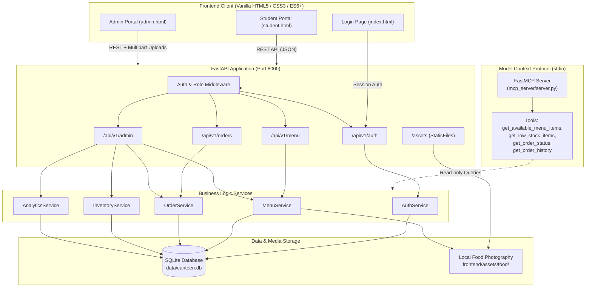
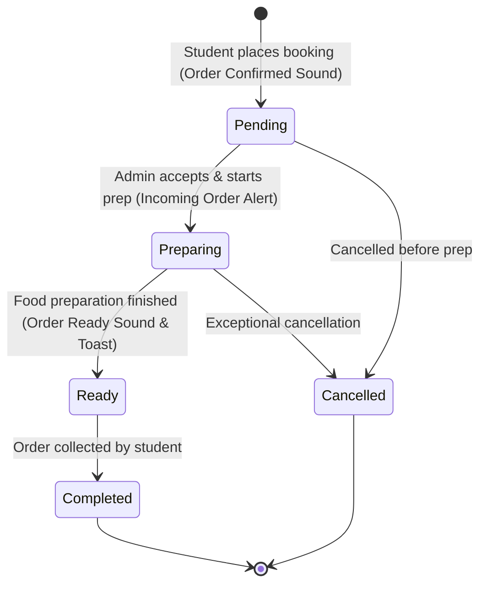

# Smart Canteen Booking System

[](https://www.python.org/)
[](https://fastapi.tiangolo.com/)
[](https://www.sqlite.org/)
[](tests/)
[](frontend/)
[](mcp_server/)

A full-stack campus canteen management and food booking system built for **Kiro University**. The application enables students to browse interactive menus, place food bookings, and track order progress in real-time with dedicated audio and visual notifications. It empowers canteen administrators with comprehensive tools to manage food items with custom image uploads, monitor real-time stock levels with low-stock alerts, track incoming student orders with live audio alerts, process orders through a robust state machine, and analyze daily and historical sales trends.

---

## 🏛️ System Architecture



---

## 🚀 Key Features

### 🎓 Student Portal (`/student.html`)
- **Interactive Menu Browsing**: Browse menu items categorized by Meals, Snacks, Beverages, and more.
- **Instant Search & Filtering**: Real-time client-side search across dish names and descriptions.
- **Cart Management**: Add items to cart with live quantity limits, stock checks, and total calculation.
- **Order Placement & Tracking**: Place bookings and track order status live (`pending` → `preparing` → `ready` → `completed` / `cancelled`).
- **Dual-Channel Audio Notifications**: Dedicated real-time audio chimes for successful order confirmation (`order-confirmed.wav`) and when orders become ready for pickup (`order-ready.wav`), backed by Web Audio API synthesis fallback and accessible Sound On/Off control.
- **Order History**: View past orders with complete item breakdowns, timestamps, and status tags.

### 🛠️ Admin Portal (`/admin.html`)
- **Menu Management**:
  - Add, edit, soft-delete, and toggle availability of food items.
  - **Food Image Upload**: Drag-and-drop / file selector supporting PNG, JPEG, and WebP (up to 5MB) with instant client-side preview, image replacement, and default fallback.
- **Inventory & Stock Control**:
  - Live inventory monitoring with low-stock badges.
  - Configurable alert thresholds (`stock_quantity <= stock_threshold`).
  - Restock action triggers with automatic status updates.
- **Live Order Management & Audio Alerts**:
  - Filterable order queue (`All`, `Pending`, `Preparing`, `Ready`, `Completed`, `Cancelled`).
  - Real-time incoming order detection via 5-second polling with dedicated attention chime (`new-order.wav`) and Web Audio API fallback.
  - Header Sound Toggle (Sound On/Off) with persistent state.
  - Status progression workflow with one-click transitions and validation.
- **Sales Analytics Dashboard**:
  - Daily revenue, total orders, and average order value.
  - Top-selling food items ranking.
  - Multi-day revenue and order volume trends.

### 🤖 Model Context Protocol (MCP) Integration (`mcp_server/`)
- Bundled MCP server using stdio transport for IDEs and AI assistants (e.g., Kiro).
- Read-only operational inspection into live menu availability, low-stock inventory alerts, order status, and student order histories without mutating database state.

### 🪝 Kiro Automation Hooks (`.kiro/hooks/`)
- **Python Syntax Validation (`python-validation.json`)**: Real-time project-specific hook that triggers on `PostFileSave` for any Python file (`.*\.py$`), executing `python -m compileall backend mcp_server` to ensure syntax validity in milliseconds without running full heavy test suites.
- **Kironomics Activity Tracking (`kironomics.json`)**: Non-intrusive workspace tool and session activity counter.

---

## 🔄 Order Lifecycle State Machine



---

## 🍛 Pre-Seeded Indian Cuisine Menu

The system comes pre-seeded with popular campus canteen favorites and dedicated local photography:

| Item Name | Category | Price | Initial Stock | Alert Threshold | Local Image Asset |
| :--- | :--- | :--- | :--- | :--- | :--- |
| **South Indian Chicken Biryani** | Meals | ₹120.00 | 20 | 5 | `assets/food/biryani.jpg` |
| **Lemon Rice** | Meals | ₹70.00 | 20 | 5 | `assets/food/lemon-rice.jpg` |
| **Curd Rice** | Meals | ₹60.00 | 20 | 5 | `assets/food/curd-rice.jpg` |
| **Masala Dosa** | Meals | ₹50.00 | 25 | 5 | `assets/food/dosa.jpg` |
| **Idli Sambar** | Meals | ₹40.00 | 30 | 8 | `assets/food/idli.jpg` |
| **Veg Biryani** | Meals | ₹90.00 | 20 | 5 | `assets/food/veg-biryani.jpg` |
| **Samosa (2 pcs)** | Snacks | ₹30.00 | 40 | 10 | `assets/food/samosa.jpg` |
| **Veg Puff** | Snacks | ₹25.00 | 35 | 8 | `assets/food/veg-puff.jpg` |
| **South Indian Filter Coffee** | Beverages | ₹20.00 | 50 | 15 | `assets/food/filter-coffee.jpg` |
| **Masala Tea** | Beverages | ₹15.00 | 50 | 15 | `assets/food/tea.jpg` |
| **Fresh Lime Soda** | Beverages | ₹30.00 | 30 | 10 | `assets/food/lime-soda.jpg` |

*Newly added items without custom photos automatically fall back to curated category default images or `assets/food/default-food.jpg`.*

---

## 🛠️ Technology Stack

| Layer | Technologies |
| :--- | :--- |
| **Backend API** | Python 3.8+ / 3.13, FastAPI 0.115+, Uvicorn, Pydantic v2 |
| **Database & ORM** | SQLite (`data/canteen.db`), SQLAlchemy ORM |
| **Frontend** | Vanilla HTML5, CSS3 (Responsive Grid/Flexbox), ES6+ JavaScript modules (zero external UI dependencies) |
| **Media & Audio** | Local asset storage (`frontend/assets/food/`), HTML5 Audio & Web Audio API dual synthesis (`order-confirmed.wav`, `order-ready.wav`, `new-order.wav`) |
| **AI / Protocol** | Model Context Protocol (`mcp` Python SDK with FastMCP) |
| **Testing** | pytest, pytest-asyncio, FastAPI TestClient, Hypothesis (property-based testing) |

---

## 📁 Project Structure

```text
my-kiro-project/
├── .kiro/                   # Kiro configuration & automation hooks
│   └── hooks/               # Workspace event hooks
│       ├── python-validation.json  # Auto Python syntax validation (PostFileSave)
│       └── kironomics.json         # Workspace activity counter hook
├── backend/
│   ├── models/              # SQLAlchemy ORM models (MenuItem, Order, OrderItem, Session)
│   ├── schemas/             # Pydantic validation schemas (Menu, Order, Auth, etc.)
│   ├── routes/              # FastAPI route handlers (auth, menu, orders, admin)
│   ├── services/            # Core business logic layer (Menu, Order, Inventory, Analytics, Auth)
│   ├── middleware/          # Authentication and authorization middleware
│   ├── utils/               # Shared utilities
│   ├── config.py            # Pydantic Settings & environment validation
│   ├── database.py          # SQLAlchemy engine, session maker, init_db
│   └── main.py              # FastAPI application entrypoint & static mounting
├── frontend/
│   ├── assets/              # Static media
│   │   ├── food/            # Food item photos (biryani, curd-rice, lemon-rice, uploads, fallbacks)
│   │   └── sounds/          # Sound notification chimes (order-ready.wav, order-confirmed.wav, new-order.wav)
│   ├── css/                 # Stylesheets (base, components, layouts, responsive)
│   ├── js/                  # Modular ES6 JavaScript
│   │   ├── admin.js         # Admin dashboard, inventory, menu CRUD, image upload & order polling
│   │   ├── api.js           # Centralized API client with multipart support
│   │   ├── audio.js         # Audio notification manager (HTML5 Audio & Web Audio API fallback)
│   │   ├── auth.js          # Client-side session and auth state
│   │   ├── cart.js          # Cart state, item counters, stock checks
│   │   ├── menu.js          # Menu rendering, category filtering, search
│   │   ├── orders.js        # Order history, live status tracking & pickup alerts
│   │   └── utils.js         # Formatting, image fallback logic, notifications
│   ├── index.html           # Landing page & role-based login
│   ├── student.html         # Student ordering and status tracking portal
│   ├── admin.html           # Administrator control center
│   └── README.md            # Frontend architecture documentation
├── mcp_server/
│   ├── server.py            # FastMCP server exposing read-only tools
│   └── README.md            # MCP protocol and tool documentation
├── scripts/
│   ├── add_briyani_to_menu.py     # Menu seeding / migration script
│   ├── add_curd_rice_to_menu.py   # Menu seeding / migration script
│   ├── add_lemon_rice_to_menu.py  # Menu seeding / migration script
│   └── verify_setup.py            # Environment and setup verification
├── steering/                # Architecture, business rules, and UI guidelines
├── tests/
│   ├── unit/                # Unit tests (schemas, models, services, MCP)
│   ├── properties/          # Property-based tests (Hypothesis)
│   └── integration/         # API endpoint integration tests
├── data/                    # SQLite database storage (canteen.db)
├── logs/                    # Application runtime logs (canteen.log)
├── requirements.txt         # Python project dependencies
├── POWER.md                 # Kiro Power specification & MCP server registry
└── README.md                # Main project documentation
```

---

## ⚡ Quick Start

### 1. Prerequisites
- **Python 3.8+** (Python 3.11–3.13 recommended)
- **pip** package manager
- Any modern web browser (Chrome, Firefox, Safari, Edge)

### 2. Environment Setup
```bash
# Clone the repository and navigate into project directory
cd my-kiro-project

# Create a virtual environment
python -m venv venv

# Activate the virtual environment
# Windows (PowerShell):
.\venv\Scripts\Activate.ps1
# Windows (cmd):
.\venv\Scripts\activate.bat
# macOS / Linux:
source venv/bin/activate

# Install dependencies
pip install -r requirements.txt

# (Optional) Setup environment variables
cp .env.example .env
```

### 3. Run the Backend API
```bash
python -m uvicorn backend.main:app --reload --host 0.0.0.0 --port 8000
```
- API Base URL: `http://localhost:8000`
- Interactive Swagger UI Docs: `http://localhost:8000/docs`
- ReDoc Alternative Docs: `http://localhost:8000/redoc`
- Health Check: `http://localhost:8000/health`

### 4. Run the Frontend Client
In a separate terminal (with the virtual environment active):
```bash
python -m http.server 3000 --directory frontend
```
Open your browser and navigate to:
- **Login / Landing Page**: `http://localhost:3000/index.html`
- **Student Portal**: `http://localhost:3000/student.html`
- **Admin Portal**: `http://localhost:3000/admin.html`

### 5. (Optional) Run the MCP Server
```bash
python -m mcp_server.server
```

---

## 🔑 Login & Roles

The system uses server-side session tokens with role-based authorization. For development and evaluation, log in from `index.html`:

| Role | Identifier Format | Access Scope |
| :--- | :--- | :--- |
| **Student** | Any valid student ID (e.g. `STU001`, `STU12345`) | Menu browsing, cart, order creation, live order tracking, order history |
| **Admin** | Any valid admin ID (e.g. `ADMIN001`, `admin`) | Menu management, image upload, inventory controls, order processing, analytics |

---

## 📖 REST API Reference

### Health & Static
| Method | Endpoint | Access | Description |
| :--- | :--- | :--- | :--- |
| `GET` | `/health` | Public | API health check |
| `GET` | `/` | Public | Root status and API documentation index |
| `GET` | `/assets/{filepath}` | Public | Static assets (food images, fallback assets) |

### Authentication (`/api/v1/auth`)
| Method | Endpoint | Access | Description |
| :--- | :--- | :--- | :--- |
| `POST` | `/api/v1/auth/login` | Public | Authenticate user and issue session token |
| `POST` | `/api/v1/auth/logout` | Authenticated | Invalidate current session token |

### Menu (Student) (`/api/v1/menu`)
| Method | Endpoint | Access | Description |
| :--- | :--- | :--- | :--- |
| `GET` | `/api/v1/menu/items` | Student / Admin | Retrieve active menu items (supports `?search=` and `?category=`) |
| `GET` | `/api/v1/menu/items/{id}` | Student / Admin | Retrieve details of a specific available menu item |

### Orders (Student) (`/api/v1/orders`)
| Method | Endpoint | Access | Description |
| :--- | :--- | :--- | :--- |
| `POST` | `/api/v1/orders` | Student Only | Place a new food booking |
| `GET` | `/api/v1/orders/{id}` | Student / Admin | Retrieve order details and current status |
| `GET` | `/api/v1/orders/history` | Student Only | Retrieve student's order history (supports `?status=`) |

### Admin Management (`/api/v1/admin`)
| Method | Endpoint | Access | Description |
| :--- | :--- | :--- | :--- |
| `POST` | `/api/v1/admin/menu/upload-image` | Admin Only | Upload food image (PNG, JPEG, WebP up to 5MB) |
| `POST` | `/api/v1/admin/menu/items` | Admin Only | Create a new menu item |
| `GET` | `/api/v1/admin/menu/items` | Admin Only | List all items (including unavailable/soft-deleted items) |
| `PUT` | `/api/v1/admin/menu/items/{id}` | Admin Only | Update menu item details and image URL |
| `DELETE` | `/api/v1/admin/menu/items/{id}` | Admin Only | Soft-delete a menu item |
| `PATCH` | `/api/v1/admin/menu/items/{id}/availability` | Admin Only | Toggle item availability status |
| `GET` | `/api/v1/admin/inventory/low-stock` | Admin Only | List items at or below alert threshold |
| `PATCH` | `/api/v1/admin/inventory/{id}/restock` | Admin Only | Restock item inventory quantity |
| `PUT` | `/api/v1/admin/inventory/{id}/threshold` | Admin Only | Update low-stock alert threshold |
| `GET` | `/api/v1/admin/orders` | Admin Only | List all orders with optional status and date filters |
| `GET` | `/api/v1/admin/orders/{id}` | Admin Only | Get detailed order info and line items |
| `PATCH` | `/api/v1/admin/orders/{id}/status` | Admin Only | Advance order status (`pending` → `preparing` → `ready` → `completed` / `cancelled`) |
| `GET` | `/api/v1/admin/analytics/daily` | Admin Only | Daily revenue, order counts, and averages |
| `GET` | `/api/v1/admin/analytics/popular` | Admin Only | Top-selling menu items |
| `GET` | `/api/v1/admin/analytics/sales-trend` | Admin Only | Historical sales revenue trends |
| `GET` | `/api/v1/admin/analytics/dashboard` | Admin Only | Unified admin dashboard metrics |

---

## 💻 API Usage Examples

### 1. Student Login
```bash
curl -X POST http://localhost:8000/api/v1/auth/login \
  -H "Content-Type: application/json" \
  -d '{"user_id": "STU12345", "role": "student"}'
```
*Response:*
```json
{
  "token": "3fa85f64-5717-4562-b3fc-2c963f66afa6",
  "user_id": "STU12345",
  "role": "student",
  "expires_at": "2026-10-06T23:00:00"
}
```

### 2. Fetch Available Menu Items
```bash
curl -X GET "http://localhost:8000/api/v1/menu/items?category=Meals" \
  -H "Authorization: Bearer <TOKEN>"
```

### 3. Place an Order
```bash
curl -X POST http://localhost:8000/api/v1/orders \
  -H "Authorization: Bearer <TOKEN>" \
  -H "Content-Type: application/json" \
  -d '{
    "items": [
      {"menu_item_id": 1, "quantity": 2},
      {"menu_item_id": 3, "quantity": 1}
    ]
  }'
```

### 4. Admin Image Upload
```bash
curl -X POST http://localhost:8000/api/v1/admin/menu/upload-image \
  -H "Authorization: Bearer <ADMIN_TOKEN>" \
  -F "file=@/path/to/food_photo.jpg"
```
*Response:*
```json
{
  "image_url": "assets/food/upload_a1b2c3d4_food_photo.jpg"
}
```

---

## ⚙️ Configuration Reference

Configuration is managed via environment variables (or a local `.env` file):

| Variable | Type | Default Value | Description |
| :--- | :--- | :--- | :--- |
| `DATABASE_URL` | string | `sqlite:///./data/canteen.db` | SQLAlchemy connection string |
| `SERVER_HOST` | string | `0.0.0.0` | API bind address |
| `SERVER_PORT` | integer | `8000` | API server port |
| `SECRET_KEY` | string | `CHANGE_THIS_IN_PRODUCTION` | Cryptographic secret for tokens |
| `SESSION_EXPIRY_HOURS` | integer | `24` | Session lifetime in hours |
| `RATE_LIMIT_PER_MINUTE` | integer | `100` | Rate limiter threshold |
| `CORS_ORIGINS` | string | `http://localhost:3000` | Comma-separated allowed origins |
| `LOG_LEVEL` | string | `INFO` | Logging level (`DEBUG`, `INFO`, `WARNING`, `ERROR`) |
| `LOG_FILE` | string | `logs/canteen.log` | Destination path for file logging |

---

## 🧪 Testing Suite

The project maintains comprehensive test coverage across unit, property-based, and integration tests:

```bash
# Run the complete test suite quietly
pytest -q --tb=no

# Run tests with detailed verbose output
pytest tests/ -v

# Run with HTML coverage report
pytest tests/ -v --cov=backend --cov-report=html

# Run property-based tests (Hypothesis)
pytest tests/properties/ -v

# Run MCP server tests
pytest tests/unit/test_mcp_server.py -v
```

**Test Suite Status**: ✅ **323 passed**, 0 failures.

---

## 🔒 Security & Data Integrity

- **Strict Validation**: All payloads validated using Pydantic v2 schemas.
- **SQL Injection Prevention**: All queries execute through SQLAlchemy ORM parameterization (no raw SQL).
- **Role-Based Session Guard**: Route-level dependency injection verifying roles (`require_auth`, `require_admin`).
- **File Upload Safety**: Content-type check, extension whitelisting, file size cap (5MB), and filename sanitization with UUID prefixes.
- **Atomic Operations**: Database transactions ensure stock deductions and order creations remain fully synchronized.

---

## ❓ Frequently Asked Questions (FAQ)

<details>
<summary><b>1. Why does the student menu fail to connect to the backend?</b></summary>
Ensure the FastAPI backend is running on port 8000 (<code>python -m uvicorn backend.main:app --host 0.0.0.0 --port 8000</code>) and that CORS in <code>.env</code> allows <code>http://localhost:3000</code>.
</details>

<details>
<summary><b>2. How are custom uploaded food images served?</b></summary>
Uploaded images are saved in <code>frontend/assets/food/</code> and served statically by FastAPI under the <code>/assets</code> mount point, making them accessible to both frontend and external clients.
</details>

<details>
<summary><b>3. How do I reset or re-seed the SQLite database?</b></summary>
Delete <code>data/canteen.db</code> and re-run the backend server to create tables, then execute <code>python scripts/add_briyani_to_menu.py</code>, <code>python scripts/add_curd_rice_to_menu.py</code>, and <code>python scripts/add_lemon_rice_to_menu.py</code> to populate initial dishes.
</details>

<details>
<summary><b>4. How does the sound notification system handle browser autoplay restrictions?</b></summary>
Modern browsers restrict unprompted audio autoplay. The application attaches early user gesture listeners (<code>pointerdown</code>, <code>keydown</code>, <code>click</code>) to unlock the audio context on first interaction, and includes a resilient Web Audio API synthesis fallback that ensures chimes still sound even if direct HTML5 Audio file playback is hindered. Sound can also be toggled on/off via the header button at any time.
</details>

---

## 📄 License

Copyright © 2026 Kiro University. All rights reserved.
